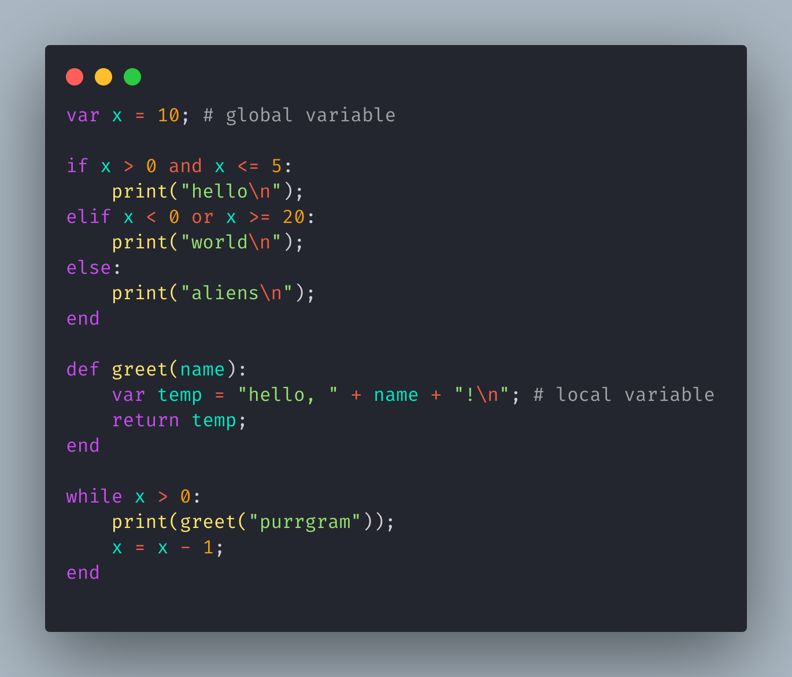
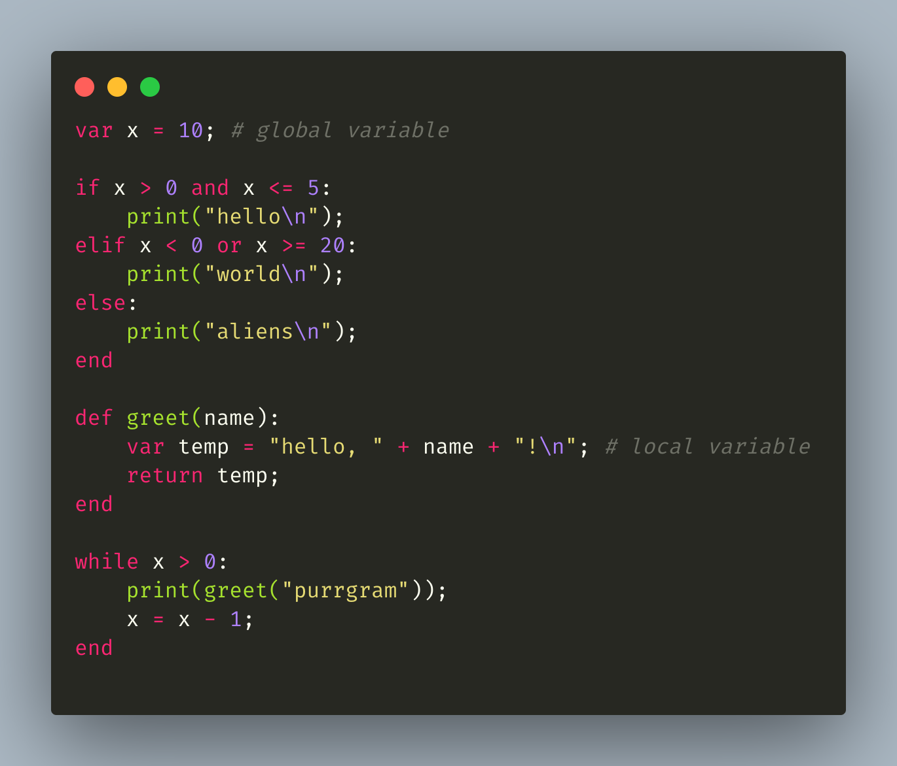

<h1 align="center">
   
    
    
  Purrgram Syntax for <a href="http://code.visualstudio.com">Visual Studio Code</a>
    
</h1>

<h3 align="center">A syntax highlighting extension for <a href="https://github.com/SohamMalakar/purrgram.git">Purrgram</a>.</h3>

 

## About

This is a syntax highlighter for Purrgram Programming Language written by [Soham Malakar](https://www.linkedin.com/in/soham-malakar-108533207).

## Screenshots

|                   Andromeda                   |                  Monokai-Pro                   |
| :-------------------------------------------: | :--------------------------------------------: |
|  |  |

## Contribution

If you want to contribute to this extension, please open an issue on [GitHub](https://github.com/SohamMalakar/purrgram-syntax-highlighter/issues).
